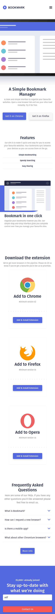

# Frontend Mentor - Bookmark landing page solution

This is a solution to the [Bookmark landing page challenge on Frontend Mentor](https://www.frontendmentor.io/challenges/bookmark-landing-page-5d0b588a9edda32581d29158). Frontend Mentor challenges help you improve your coding skills by building realistic projects.

## Table of contents

- [Overview](#overview)
  - [The challenge](#the-challenge)
  - [Screenshot](#screenshot)
  - [Links](#links)
- [My process](#my-process)
  - [Built with](#built-with)
  - [What I learned](#what-i-learned)
  - [Continued development](#continued-development)
  - [Useful resources](#useful-resources)
- [Author](#author)
- [Acknowledgments](#acknowledgments)

## Overview

### The challenge

Users should be able to:

- View the optimal layout for the site depending on their device's screen size
- See hover states for all interactive elements on the page
- Receive an error message when the newsletter form is submitted if:
  - The input field is empty
  - The email address is not formatted correctly

### Screenshot

### Links

- Solution URL: [Solution URL](https://github.com/imandreans/bookmark-landing-page-master)
- Live Site URL: [Live Site](https://imandreans.github.io/bookmark-landing-page-master/)

## My process

### Built with

- Semantic HTML5 markup
- SCSS
- Flexbox
- CSS Grid
- Bootstrap 5
- Vanilla Javascript

### What I learned

Been a while since I build Front End Manager. I learned a lot how to import and use bootstrap 5 and use Javascript to validate the input email.

### Continued development

There are a lot of things I should cover later. Like the size of image on hero section is too big on Mobile Screen. Also, a lot of adjustment on how i write the HTML and CSS (it's not really pretty to see), improve the consistency of the color and size of each component, and fix the design tablet in tablet mode.

## Author

- Website - [Andrean](https://imandreans.github.io/portfolio/)
- Frontend Mentor - [@yourusername](https://www.frontendmentor.io/profile/imandreans)
- Twitter - [@imandreans](https://www.twitter.com/imandreans)
